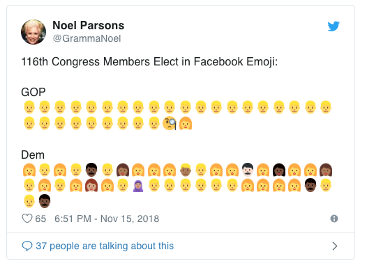

# house-of-representatives

I stumbled upon the following emoji and it made me super curious about what other differences exist between the two parties.

This is an attempt to scrape data from Wikipedia from this link https://en.wikipedia.org/wiki/List_of_current_members_of_the_United_States_House_of_Representatives (116th)
